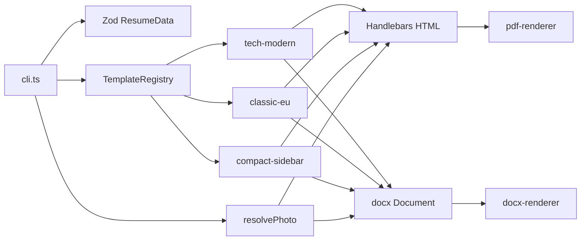

# Plan: EU CV Generator CLI

**Status:** Implemented — verified with `npm run test-run:all` (6 outputs).

## Overview

Build a production-ready TypeScript / Node.js CLI that converts `resume.json` into pixel-perfect A4 PDF and native Microsoft Word (`.docx`) resumes for international tech candidates targeting Europe (EU Blue Card, 30-day notice, relocation-ready).

- **Photo:** First-class professional headshot support (EU recruiter expectation).
- **Templates (v1):** Exactly three — `tech-modern`, `classic-eu`, `compact-sidebar`.
- **Formats:** PDF (Playwright + Handlebars HTML) and DOCX (`docx` library).

## Goals

- Strict Zod validation of resume data.
- ATS-friendly European layout norms (A4, clear section headers, no alignment collisions).
- EU mobility banner (Blue Card eligibility, relocation, notice period).
- Pluggable template registry so future templates drop in without touching renderers.
- CLI runnable from any working directory (ESM-safe paths).

## Non-goals (v1)

- Additional templates beyond the three listed.
- Interactive TUI / GUI.
- Online hosting or SaaS.
- Automatic LinkedIn scraping.

## Architecture



## Templates

| ID | Layout | Photo placement | Audience fit |
|----|--------|-----------------|--------------|
| `tech-modern` | Single-column, navy/charcoal | Circular crop, top-right beside name/contact | Default; modern SaaS / product roles |
| `classic-eu` | Formal single-column, denser type | Rectangular photo, top-left classic EU header | DE/NL traditional ATS + human review |
| `compact-sidebar` | Two-column print layout | Photo at top of left sidebar with skills/languages/EU meta | Dense senior profiles; skills-heavy |

Default CLI template: **`tech-modern`**.

## Target file tree

```
eu-cv-cli/
├── PLAN.md
├── README.md
├── package.json
├── tsconfig.json
├── resume.json
├── assets/
│   └── sample-photo.jpg
└── src/
    ├── cli.ts
    ├── schema/
    │   └── resume.schema.ts
    ├── core/
    │   ├── pdf-renderer.ts
    │   └── docx-renderer.ts
    ├── utils/
    │   ├── formatters.ts
    │   └── photo.ts
    └── templates/
        ├── types.ts
        ├── index.ts
        ├── shared/
        │   └── register-helpers.ts
        ├── tech-modern/
        │   ├── index.ts
        │   ├── template.html
        │   └── docx.ts
        ├── classic-eu/
        │   ├── index.ts
        │   ├── template.html
        │   └── docx.ts
        └── compact-sidebar/
            ├── index.ts
            ├── template.html
            └── docx.ts
```

## Implementation workstreams

### 1. Config & sample data

- `package.json`: `"type": "module"`; deps `playwright`, `docx`, `commander`, `handlebars`, `zod`; devDeps `typescript`, `tsx`, `@types/node`.
- Scripts:
  - `generate` → `tsx src/cli.ts`
  - `test-run` → tech-modern, `pdf,docx`
  - `test-run:all` → all three templates, `pdf,docx`
- `tsconfig.json`: `module` / `moduleResolution` `NodeNext`, `target` `ES2022`, `strict`, `skipLibCheck`.
- `resume.json`: Senior AI / Software Engineer sample with `basics.image`, `euMetadata`, skills, work (XYZ bullets), education, CEFR languages, projects.
- `assets/sample-photo.jpg`: bundled placeholder headshot.

### 2. Schema & utilities

- Zod schema matching `resume.json`; export `ResumeData`.
- `basics.image` optional string; sample always sets it.
- Formatters: `formatDate` (`2022-01` → `Jan 2022`), empty end → `Present`, `joinList`, filename slug.
- Photo utils:
  - Resolve path relative to **resume JSON directory** (not `process.cwd()`).
  - `toDataUrl` for HTML/PDF; `toImageBuffer` for DOCX `ImageRun`.
  - Missing image → render without photo (no crash).

### 3. Templates (×3)

Shared rules for every template:

- ESM-safe HTML load via `fileURLToPath(import.meta.url)`.
- Handlebars helpers registered once (dates, list join).
- EU mobility banner (Blue Card / relocation / 30-day notice).
- PDF CSS: `@page { size: A4; margin: 12mm 15mm; }`; `break-inside: avoid` on entries; charcoal `#1e293b`, borders `#e2e8f0`, navy accent.
- DOCX: margins **720 dxa**; uppercase section headers with bottom border; role title/date tables with `width: { size: 100, type: WidthType.PERCENTAGE }` and cells **75% / 25%**; native bullets.

Interface (`CVTemplate`):

```typescript
export interface CVTemplate {
  id: string;
  name: string;
  description: string;
  renderHtml(data: ResumeData): Promise<string>;
  renderDocx(data: ResumeData): Promise<Document>;
}
```

Registry exports `TemplateRegistry` and `getTemplate(id)`.

### 4. Core renderers & CLI

- PDF: Playwright Chromium headless; `setContent` + `page.pdf` A4; close browser in `finally`.
- DOCX: `Packer.toBuffer()` → write file.
- CLI (Commander):
  - `-i, --input` default `./resume.json`
  - `-t, --template` default `tech-modern`
  - `-f, --format` default `pdf,docx`
  - `-o, --outdir` default `./output`

### 5. Output naming

`{outdir}/{SanitizedName}_CV_{templateId}.{pdf|docx}`

Example: `./output/Jane_Doe_CV_tech-modern.pdf`

## Implementation watchlist

1. **ESM path for `template.html`:** resolve with `fileURLToPath(import.meta.url)`, never `process.cwd()`.
2. **Handlebars helpers:** date formatting + array joining without trailing delimiters.
3. **DOCX table widths:** table-level percentage width 100%; cells 75% / 25%.
4. **Photo embedding:** data URL for PDF; `ImageRun` for Word; path relative to input JSON.

## Verification checklist (post-implementation)

1. `npm install`
2. `npx playwright install chromium`
3. `npm run test-run`
4. `npm run test-run:all`
5. Confirm six files under `./output/` (3 templates × 2 formats), each showing the photo.

## Approval gate

| Item | Decision |
|------|----------|
| Repo layout | Root of `eu-cv-cli` (not nested `eu-cv-generator/`) |
| Template count | Exactly 3 in v1 |
| Photo | Optional in schema; present in sample |
| DOCX margins | 720 dxa (0.5") |
| Secondary language sample | German A1 |

**Next step after approval:** implement the file tree, install deps, run verification.
